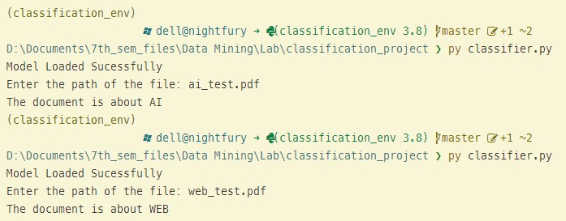

# AI based Document Classification System
Here in this a project, a simple document classification system has been created using Multinomial Naive Bayes Algorithm. This system is able to classify the PDF type documents based on their content to either AI document or WEB document.

## TODO: 
- [X] Simple PDF classification system
- [ ] More documents classification
- [ ] Deployment in Webapp

## Technologies Used: 
Machine Learning, Natural Language Processing, Python, Data Mining

## Checkout the Classifier Outputs:

## Acknowledgement
Special thanks to my mentor [Siddhant Sharma](https://github.com/Siddhant128-bit/Siddhant128-bit)
